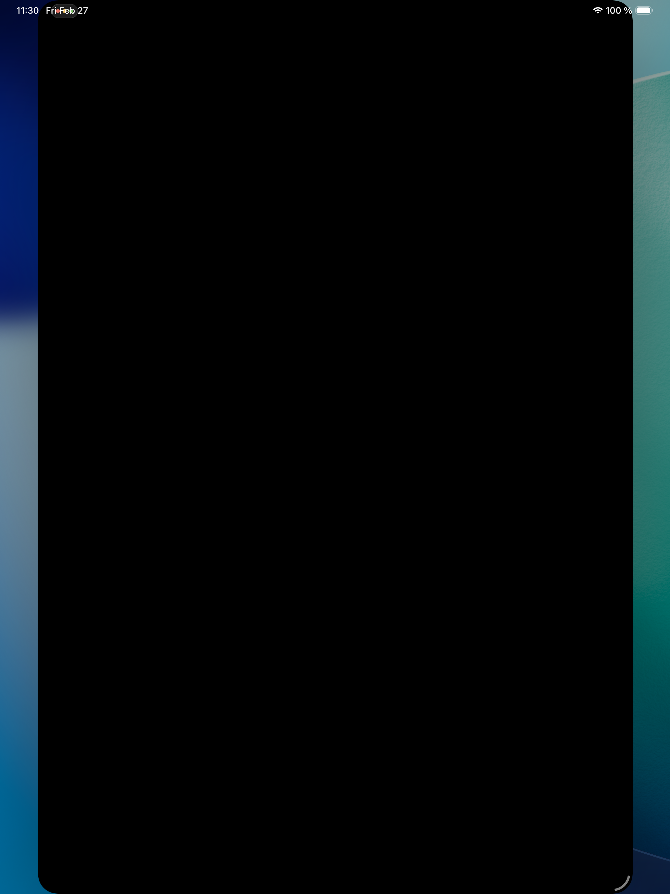
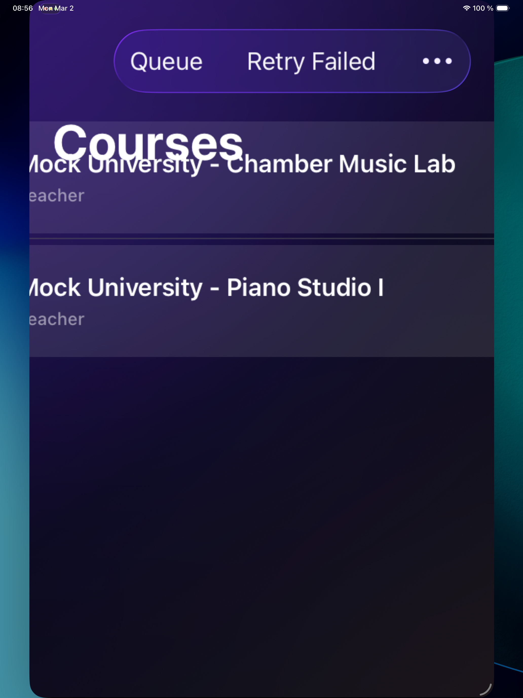
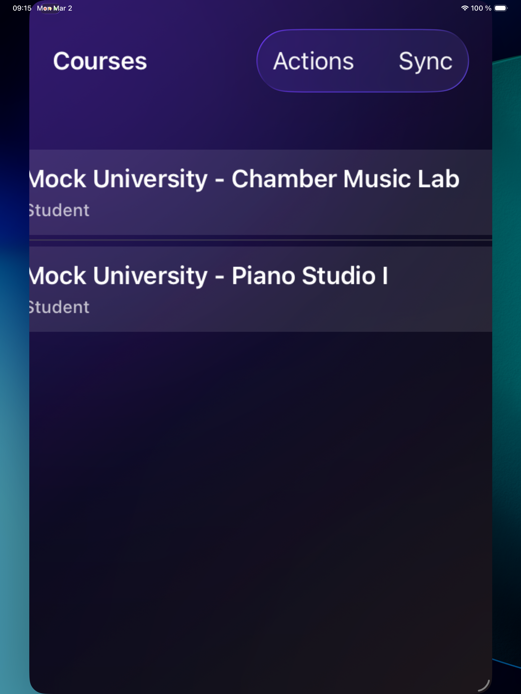
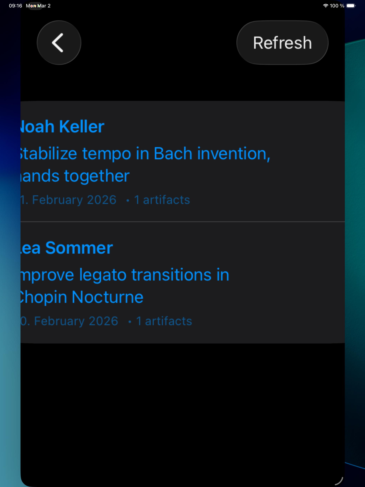
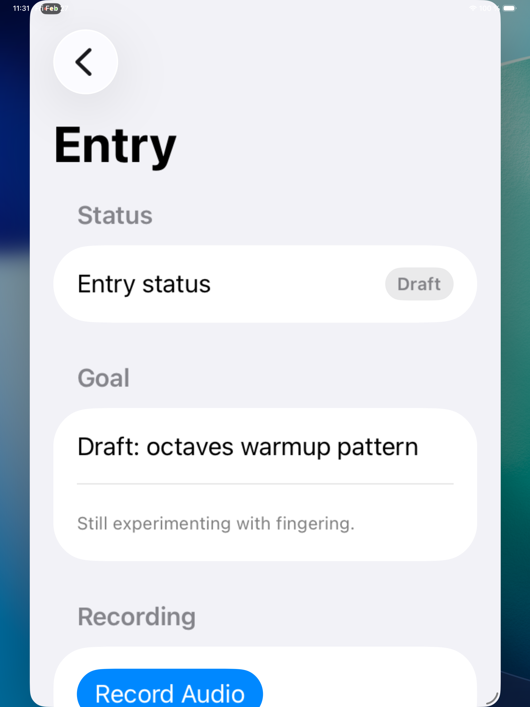
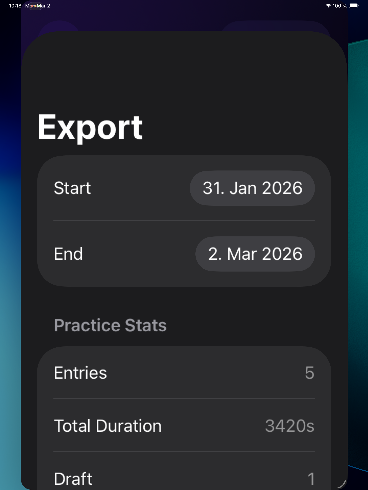
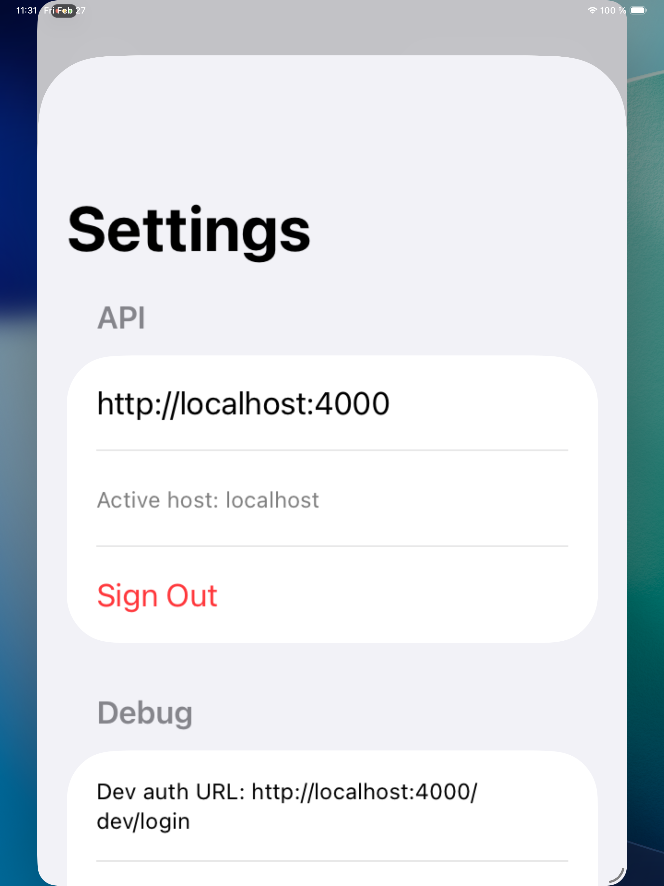
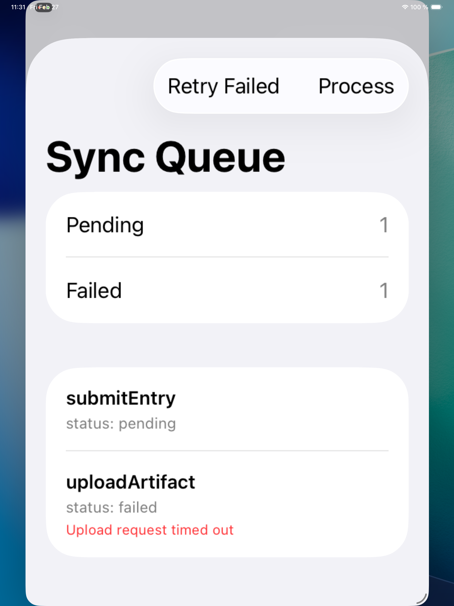

# Resonance – Practice & Feedback

[](https://github.com/sebastianspicker/resonance/actions/workflows/ci.yml)

Offline-first, iPad-first MVP for a university of music. Students capture short practice evidence (audio/video snippets), submit to a course, receive structured teacher feedback, and export summaries.

## Target Audience

- **Music university students** -- capture and submit practice evidence (audio recordings) with goals, notes, and tags. Track submission status and review teacher feedback with timestamped markers.
- **Music teachers / professors** -- review submitted practice entries, leave structured feedback with time-aligned markers, and manage a course review queue.

## Screenshots

| Student Flow | Teacher Flow |
|---|---|
|  |  |
|  |  |
|  |  |
|  | |

> See [docs/RELEASE_CANDIDATE_SCREENSHOTS.md](docs/RELEASE_CANDIDATE_SCREENSHOTS.md) for the full screenshot matrix and capture playbook.

> Production auth (university SSO via Shibboleth/OIDC) is documented but not wired up. The included server handles everything else; connect your SSO bridge when deploying.

## Features (MVP)
- Offline-first iPad app with local storage and sync queue
- Course membership and entry submission workflow
- Pre-signed uploads to S3-compatible storage (MinIO in dev)
- Teacher review queue + feedback with timestamped markers
- Token-based auth with refresh rotation (dev auth flow only)

## Monorepo Layout
- `ios/ResonanceApp/` — SwiftUI iPad app (Swift Package)
- `server/` — Node.js TypeScript backend (Fastify + Prisma)
- `infra/` — Docker Compose for Postgres + MinIO
- `docs/` — Product, architecture, security, and status docs
- `scripts/` — Helper scripts

## Requirements
- Node.js 20.x + npm
- Docker Desktop (Postgres + MinIO)
- Xcode 16+ with iPad simulator runtime (the app targets iPad)

## Quick Start (Local Dev)

### 1) Backend

1. Copy env file and set dev auth:

```bash
cp server/.env.example server/.env
```

Make sure `AUTH_MODE=dev` is set in `server/.env` for local development.

2. Start Postgres + MinIO:

```bash
docker compose -f infra/docker-compose.yml up -d
```

3. Install deps, generate Prisma client, migrate, and seed:

```bash
cd server
npm install
npm run prisma:generate
npm run prisma:migrate
npm run prisma:seed
```

4. Start the API:

```bash
npm run dev
```

API runs on `http://localhost:4000`.

### 2) iOS (iPad) app

Open the Swift Package in Xcode:

```bash
open ios/ResonanceApp/Package.swift
```

1. Select the **ResonanceApp** scheme and an **iPad simulator** as the run destination.
2. Run the app. It opens a login screen; tap "Sign In" to authenticate via the local dev server.
3. Choose a student or teacher persona. The dev server seeds a sample course ("Piano Technique 101") with a submitted entry ready for review.

The app connects to `http://localhost:4000` by default. Override with the `RESONANCE_API_BASE` environment variable in the Xcode scheme if needed.

## Configuration

Backend environment variables (see `server/.env.example`):

- `DATABASE_URL` — Postgres connection string
- `JWT_SECRET` — signing key for access tokens (required, >= 32 chars)
- `JWT_REFRESH_SECRET` — signing key for refresh tokens (optional; defaults to `JWT_SECRET + '-refresh'`)
- `AUTH_MODE` — `dev` or `prod` (defaults to `prod`)
- `CORS_ORIGINS` — comma-separated allowlist (empty = fail-closed, no cross-origin access)
- `S3_*` — MinIO/S3 endpoint + credentials

## Development Scripts (Server)

```bash
cd server
npm run dev          # start dev server
npm run build        # TypeScript build
npm run start        # run compiled server
npm run clean        # remove local build/test artifacts in server/
npm test             # run tests (requires Postgres)
npm run lint         # ESLint
npm run format       # Prettier (write)
npm run format:check # Prettier (check)
```

Workspace cleanup (repo root):
```bash
./scripts/clean-workspace.sh
```

## Tests

Backend tests require Postgres running and `DATABASE_URL` pointing to a test database (must include `test`, e.g. `resonance_test`):

```bash
docker compose -f infra/docker-compose.yml up -d
cd server
npm test
```

iOS unit tests can be run from Xcode by opening `ios/ResonanceApp/Package.swift` and using the `ResonanceAppTests` scheme. The repository does not currently track an `.xcodeproj` or `.xcworkspace`, so the CLI iOS build is skipped by local CI unless one exists.

## Validation (build / run / test)

To verify the repo end-to-end:

```bash
# Infra + backend: build and test
docker compose -f infra/docker-compose.yml up -d
cd server && npm install && npm run prisma:generate && npm run prisma:migrate && npm run prisma:seed
npm run build && npm run start &
curl -fsS http://127.0.0.1:4000/health
npm test

# Full CI-style check from repo root (starts Postgres if needed, includes iOS build when Xcode is available)
./scripts/ci-local.sh --with-docker

# Secret scan (from repo root)
./scripts/secret-scan.sh
```

`./scripts/ci-local.sh` defaults `DATABASE_URL` to `resonance_test` to match CI and the Vitest safety guard.

## RC Demo Bootstrap (Mock University)

For deterministic local release-candidate screenshots:

```bash
./scripts/demo/bootstrap-local-demo.sh
```

This seeds canonical mock data from `demo/fixtures/mock-university.json`.

To reset demo records only:

```bash
./scripts/demo/reset-local-demo.sh
```

## RC Demo Screenshots

Stored in `docs/assets/screenshots/rc/`.

### Student Persona





### Teacher Persona


## Security

- Dev auth endpoints (`/dev/*`) are disabled unless `AUTH_MODE=dev` and are restricted to localhost requests.
- Local docker-compose ports are bound to `127.0.0.1`, and the bundled Postgres/MinIO credentials are for local development only.
- Secret scanning: `./scripts/secret-scan.sh`
- Dependency audit: `npm audit --audit-level=high` (in `server/`)
- SAST: CodeQL runs in GitHub Actions (`.github/workflows/codeql.yml`)

## API Notes

- `DELETE /entries/:entryId` hard-deletes entries and associated artifacts/feedback, and deletes storage objects.
- Production auth is not implemented yet; `/auth/session` returns `AUTH_NOT_CONFIGURED` when `AUTH_MODE=prod`.

## Troubleshooting

- **`docker compose` not found**: Ensure Docker Desktop is installed and running.
- **Prisma cannot reach DB**: Confirm Postgres is running and `DATABASE_URL` is set.
- **Dev auth endpoints 404**: Set `AUTH_MODE=dev` in `server/.env`.
- **CORS issues in prod**: Set `CORS_ORIGINS` to explicit allowed origins.

## Docs
- `docs/INDEX.md` — Canonical documentation entry point
- `docs/PRD.md` — Product requirements
- `docs/ARCHITECTURE.md` — Architecture
- `docs/API.md` — API reference
- `docs/UI.md` — UI spec
- `docs/SECURITY.md` — Security documentation
- `docs/RUNBOOK.md` — Ops runbook
- `docs/RELEASE_CANDIDATE_DEMO.md` — RC demo bootstrap and preflight
- `docs/RELEASE_CANDIDATE_SCREENSHOTS.md` — screenshot matrix and capture playbook
- `docs/RELEASE_CHECKLIST.md` — release gates checklist
- `docs/BUGS_AND_FIXES.md` — Known bugs and required fixes (issue source)
- `docs/archive/` — Archived historical docs

## License
MIT.
