# Resonance v0.1.0-alpha.1 Walkthrough

This 12-screen walkthrough narrates the source alpha with deterministic mock-university data. The PNGs are visual UI evidence from Debug-only Simulator scenarios captured at clean source commit `aee02be08161d96c32b645d0d506abd4b6cdc597`.

They do not independently prove taps, networking, authorization, persistence, accessibility, localization, signing, or deployment. Those claims require the separate source, service-E2E, XCTest, and deployment gates described in the [release notes](./release-notes/v0.1.0-alpha.1.md). The English screens do not demonstrate complete German localization. The iPad images include iPadOS 26 system window chrome.

## Student flow

### 1. Sign in

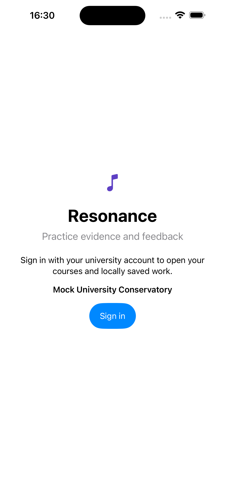

The alpha exposes the intended account entry point. The pictured development flow is loopback-only and is not a production identity-provider configuration.

### 2. Select a course

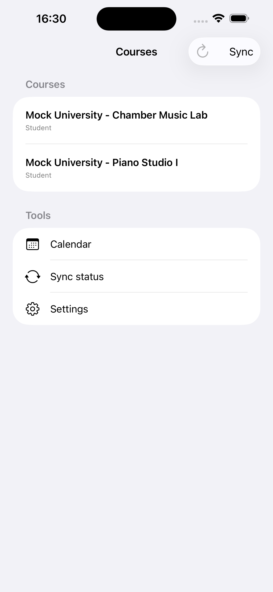

Course membership supplies the student or teacher role used by the private evidence workflow.

### 3. Review evidence status

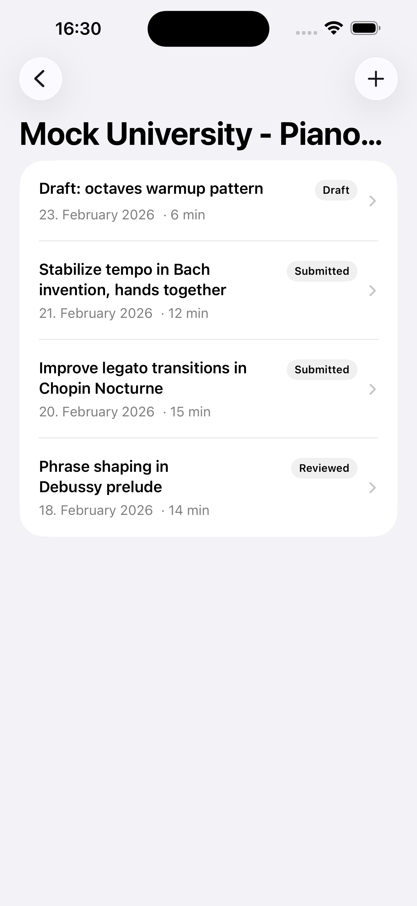

Draft, submitted, and reviewed states remain visible in words rather than relying on color alone.

### 4. Compose a new entry

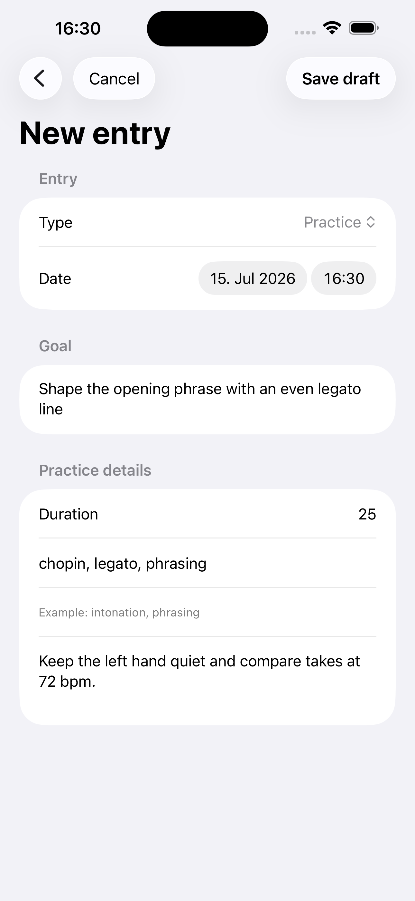

This deterministic form composition is visual-only; the screenshot does not claim that a save interaction occurred.

### 5. Prepare evidence for submission

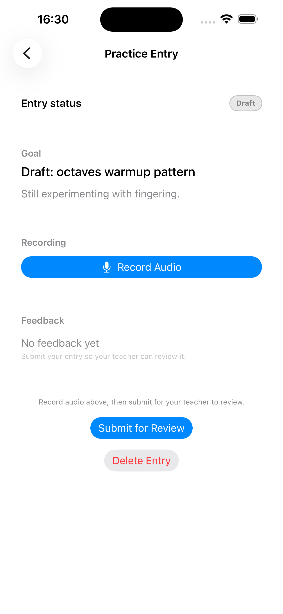

The source supports local media, upload dependencies, and submission. Measured upload and state-transition evidence comes from the process-level service E2E, not this image.

### 6. Understand pending and failed work

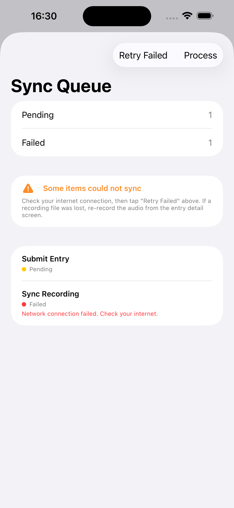

This is an intentional recovery-state fixture, not a claim that the release is currently failing to sync.

## Teacher flow

### 7. Enter a teacher course

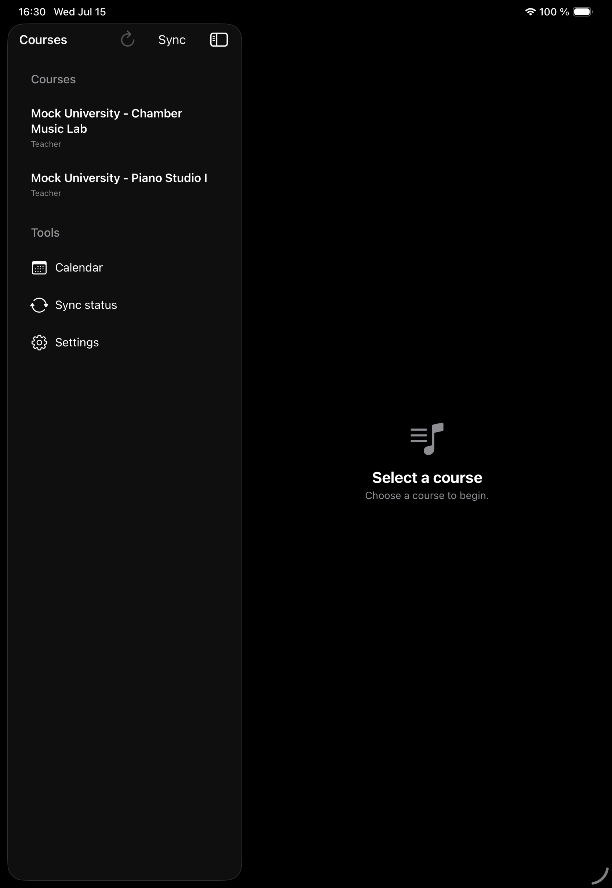

The empty detail pane is the deliberate pre-selection state; it does not represent missing data.

### 8. Review submitted evidence

The process-level E2E separately verifies that submitted entries appear only for an authorized same-course teacher.

### 9. Inspect a submission

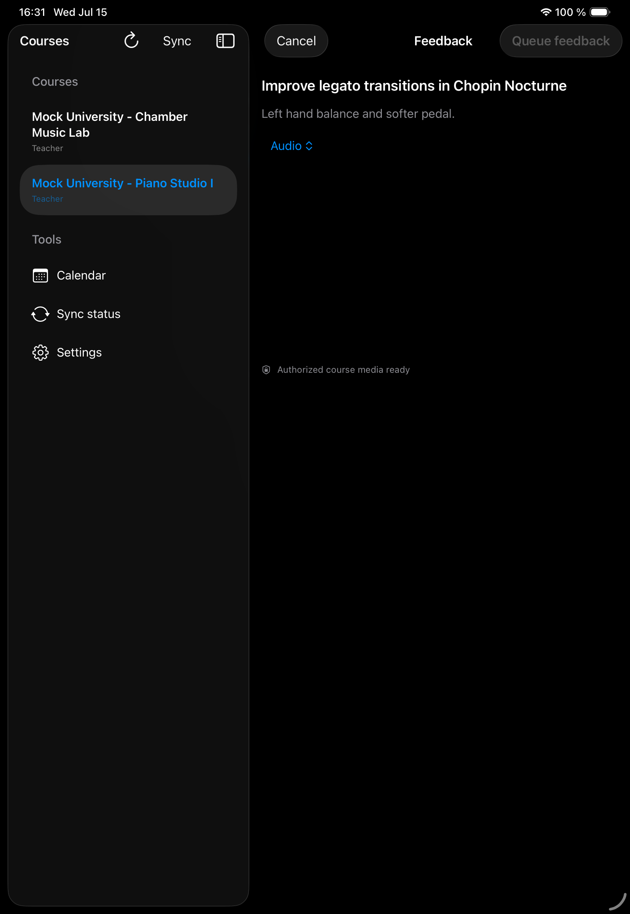

The screen shows the authorized-media-ready state. It does not show or claim playback; byte retrieval and access control are service-E2E responsibilities.

### 10. Draft timestamped feedback

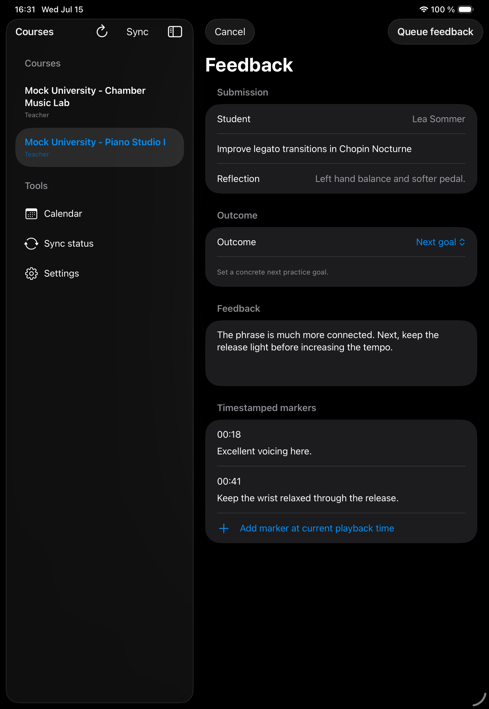

The UI groups an overall comment, next-goal status, and manual timestamps without automatic analysis or scoring.

### 11. See queued feedback

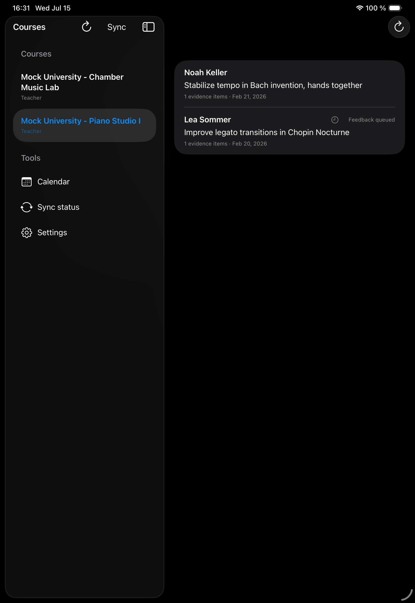

This deterministic queued state illustrates offline-first status copy. The screenshot does not prove later network delivery.

## Student receives feedback

### 12. Read the reviewed entry

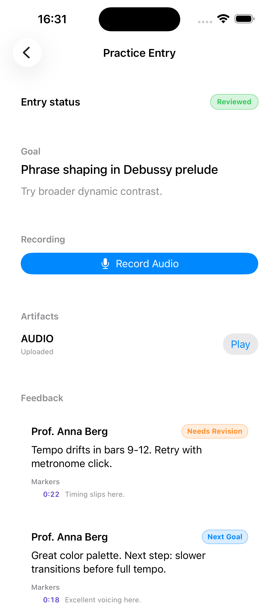

The student-facing result combines the reviewed status, teacher comment, and manual markers. Persistence and authorization are measured separately by the service gate.

## Capture and review record

- Source commit: `aee02be08161d96c32b645d0d506abd4b6cdc597` (`dirty: false`).
- Student device: iPhone portrait, iOS 26.2, light appearance, medium text size.
- Teacher device: iPad portrait, iOS 26.2, dark appearance, medium text size.
- Fixture, API readiness, Debug build, PNG integrity, dimensions, uniqueness, checksum, privacy, and visual reviews passed.
- No capture logs, local paths, real identities, tokens, private media, or transient Simulator identifiers are published.

The [manifest](./assets/screenshots/approved/v0.1.0-alpha.1/manifest.json) is the machine-readable record. See [Screenshot Evidence](./SCREENSHOTS.md) for the promotion rules and remaining matrix.
