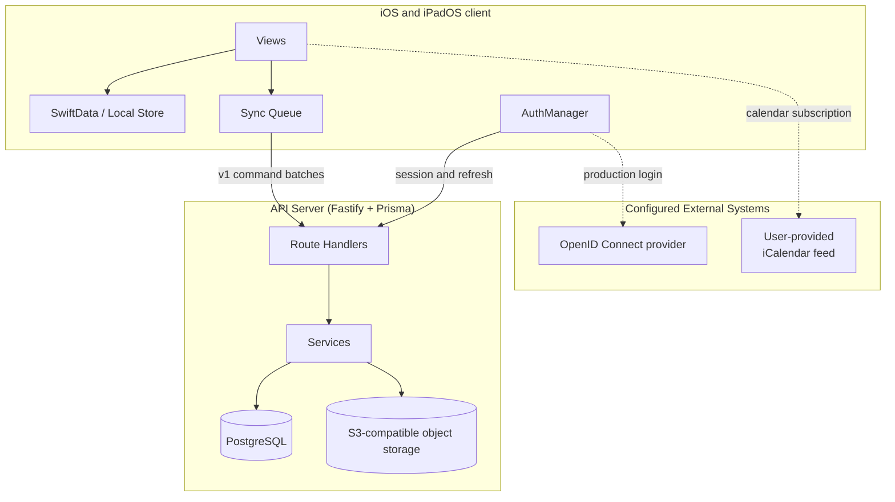
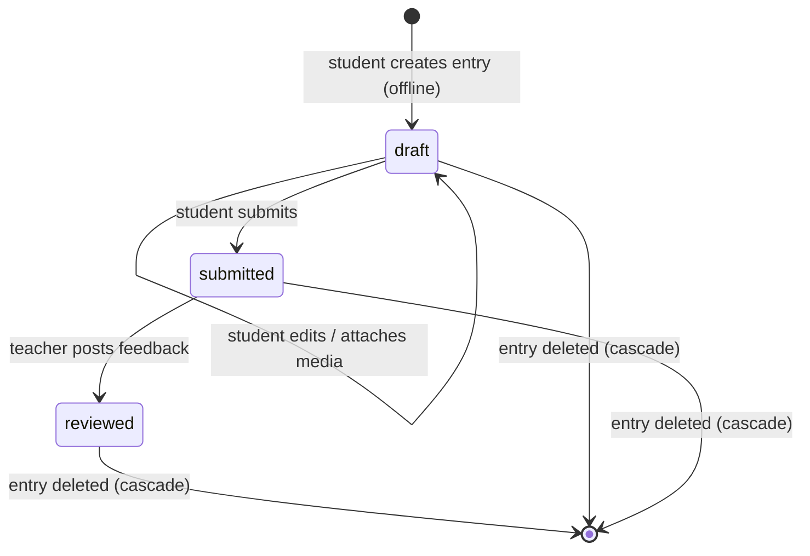

# Architecture

## System overview



## Entry lifecycle



## Runtime components

- iOS and iPadOS client: SwiftUI interface, SwiftData persistence, protected
  media files, Keychain state, and a persistent synchronization queue.
- API server: Fastify routes and services for authentication, course context,
  entry lifecycle, synchronization commands, feedback, and artifact sessions.
- PostgreSQL: users, memberships, entries, feedback, optimistic versions,
  command receipts, authentication tokens, upload sessions, and object-deletion
  jobs.
- S3-compatible storage: practice audio and teaching-lesson video. The bundled
  MinIO service is limited to loopback development and CI.
- External services: an operator-configured OpenID Connect provider and
  user-provided iCalendar feeds.

## Client composition

The iOS app starts in `ResonanceApp.swift`, opens the shared SwiftData `ModelContainer`, and injects one `AppState` into the SwiftUI tree. `AppState` wires together the long-lived services used by views:

- `AuthManager`: ASWebAuthenticationSession login, keychain-backed token persistence, refresh-token rotation, and logout.
- `APIClient`: typed HTTP wrapper for the Fastify API, v1 sync commands, and the artifact-session staging/finalization flow.
- `SyncManager`: background-safe queue coordinator; delegates persistence to `QueueStore`, retry decisions to `RetryPolicy`, and concrete network work to `TaskExecutor`.
- `NetworkMonitor`: reachability gate so offline queue items wait instead of failing immediately.

## Server composition

```
server/src/
  index.ts                    Process lifecycle and dependency startup
  server.ts                   Fastify composition and middleware
  auth.ts                     JWT and refresh-token operations
  oidc.ts                     OIDC discovery, state, and identity mapping
  config.ts                   Environment parsing and startup validation
  routes/                     HTTP route handlers
    entries/parsing.ts        Entry request parsing
    v1.ts                     Sync, artifact-session, and v1 read routes
  services/                   Transaction and storage workflows
    sync/                     Sync command admission and execution
    artifactSessions.ts       Artifact allocation and completion
    entryCascade.ts           Entry deletion and deferred object removal
    entryTransaction.ts       Entry-level transaction serialization
    deadline.ts               Bounded dependency operations
```

`index.ts` owns Prisma and S3 client lifetime. `buildServer(prisma, s3)` owns
middleware, probes, authentication, and route registration. Tests use the same
server factory with injected dependencies.

## Boundary decisions and invariants

These decisions govern the client/server decomposition. A future refactor may
move code, but it must preserve the listed contracts. If a split must be rolled
back, revert its facade and extracted units as one compatible batch rather than
mixing old and new payload, authorization, or persistence behavior.

### Ordered and idempotent v1 commands

DECISION: Keep the v1 command vocabulary and validation in a shared server
contract, execute admitted commands in request order, and mirror that vocabulary
with typed client models. Route handlers remain transport adapters; receipt,
replay, conflict, and mutation policy remain service responsibilities.

This boundary supports durable offline retries without letting a repeated or
reordered request overwrite newer work.

Invariants:

- A successful operation identifier remains bound to the authenticated user and
  the original payload. Reusing it for different work is rejected.
- A request contains 1 to 25 commands and preserves FIFO order. `createEntry`
  has no base version; every other mutation carries a positive base version.
- A version conflict returns the current version and never silently overwrites
  the server record.
- A client retries the same operation with the same identifier, reconciles a
  conflict, and never converts a terminal rejection into an overwrite.

Implementation: [server command contract](../server/src/services/sync/contract.ts),
[server admission](../server/src/services/sync/admission.ts),
[client command models](../ios/ResonanceApp/Sources/APISyncCommandModels.swift), and
[client command execution](../ios/ResonanceApp/Sources/TaskExecutor%2BCommands.swift).
Verification: [server receipt tests](../server/tests/v1-sync/command-receipts.test.ts)
and [client command tests](../ios/ResonanceApp/Tests/APIClientSyncCommandTests.swift).

### Artifact staging, completion, and deletion

DECISION: Keep upload allocation and completion in the artifact-session service,
keep signed credentials scoped to staging keys, and keep entry deletion and
object cleanup in durable cascade services. HTTP routes do not own storage
lifecycle policy.

This boundary prevents a signed PUT, concurrent completion, or delayed object
store operation from publishing mutable evidence or recreating deleted content.

Invariants:

- Only the student owner of a draft entry with the matching optimistic version
  may allocate an upload session.
- Completion publishes an immutable final key only after exact size and
  integrity checks against the observed staging object.
- Entry deletion records durable cleanup work before relational metadata
  disappears. Cleanup never deletes an object while a signed PUT or completion
  claim can still be valid.
- An expired or unsafe session rotates to a new staging key and queues the old
  key for cleanup. Completion retries use the same durable claim; storage
  failure retains a retryable deletion job.

Implementation: [artifact-session service](../server/src/services/artifactSessions.ts),
[entry deletion](../server/src/services/entryCascade/entryDeletion.ts), and
[artifact cleanup](../server/src/services/entryCascade/artifactCleanup.ts).
Verification: [artifact lifecycle tests](../server/tests/acl/entry-artifact-lifecycle.test.ts)
and [client artifact-session tests](../ios/ResonanceApp/Tests/APIClientArtifactSessionTests.swift).

### Course authorization and media visibility

DECISION: Authorize entry, feedback, and media access from current course
membership, course role, entry owner, and lifecycle state. A global student or
teacher role is never sufficient, and media inherits the visibility of its
entry.

This boundary keeps drafts and protected recordings inside their intended
student and course-review context across legacy routes, v1 routes, and replayed
commands.

Invariants:

- Students access only their own entries. Teachers must be current teachers in
  the entry's course.
- Teachers cannot list, fetch, review, or download media from student drafts.
- Authorization is rechecked during receipt replay; a previously valid command
  does not preserve access after membership changes.
- Rollback or compatibility handling must not restore draft state or relax an
  authorization check to make a retry succeed.

Implementation: [authorization helpers](../server/src/validation.ts),
[v1 routes](../server/src/routes/v1.ts), and
[artifact download route](../server/src/routes/artifacts/download.ts).
Verification: [course visibility tests](../server/tests/acl/course-visibility.test.ts)
and [artifact authorization tests](../server/tests/acl/entry-artifact-lifecycle.test.ts).

### Fail-closed runtime and local identity

DECISION: Reject invalid server configuration before startup and preserve local
credential or account data whenever cleanup cannot be verified. Development
authentication remains loopback-only; client persistence has no plaintext
fallback.

This boundary makes uncertainty visible instead of continuing with an unsafe
network binding, ambiguous credentials, or a second account using a previous
account's local data.

Invariants:

- Production is the default server mode. Production startup requires explicit
  host, CORS, and OpenID Connect configuration; development mode rejects
  non-loopback exposure.
- Credentials and local ownership use device-only Keychain storage. An
  uncertainty sentinel remains independently stored until credential removal is
  verified.
- Failed credential writes remove and verify the partial state or leave the
  client blocked. Failed owner replacement or local deletion blocks account
  admission and sign-out completion.
- Rollback may restore the previous verified session, but it must not load
  uncertain credentials, bypass the sentinel, or process a predecessor's queue.

Implementation: [server configuration](../server/src/config.ts),
[client auth persistence](../ios/ResonanceApp/Sources/AuthManager%2BPersistence.swift),
and [persistence support](../ios/ResonanceApp/Sources/AuthSessionPersistenceSupport.swift).
Verification: [server configuration tests](../server/tests/config-env.test.ts),
[client auth security tests](../ios/ResonanceApp/Tests/LocalAuthSecurityTests.swift),
and [profile replacement tests](../ios/ResonanceApp/Tests/LocalProfileReplacementTests.swift).

## iOS synchronization

The sync subsystem is split into four focused components:

- `SyncManager`: coordinator for authentication refresh, reachability, and the
  queue state machine.
- `QueueStore`: SwiftData I/O for enqueueing, ready and failed item retrieval, counts, status mutations, and artifact state helpers.
- `TaskExecutor`: executes one queue item against the API, accepts create retries only when remote identity and metadata match, and treats already-deleted resources as successful deletes.
- `RetryPolicy`: stateless exponential backoff and terminal-error classification. Validation errors, local-not-found errors, and permission errors are terminal; transient network errors are retried.
- `EntryDeletionCoordinator`: coordinates offline-safe entry deletion by cancelling in-flight artifact work, deleting local files, and enqueueing a remote delete only when the entry was already synchronized.
- `CalendarSubscriptionStore`: persists the iCal subscription URL in Keychain and migrates a legacy UserDefaults value on first access.

## Data flow

1. The app opens `GET /auth/login` with `ASWebAuthenticationSession`.
2. The server selects loopback development login or production OpenID Connect.
3. The callback returns a short-lived internal code to
   `resonance://auth-callback`.
4. The app exchanges that code at `POST /auth/session` and receives access and
   refresh tokens.
5. Course memberships and remote entries are merged into SwiftData.
6. Local mutations enter the persistent queue. The sync worker sends one to 25
   v1 commands in request order. Commands carry operation identifiers and
   optimistic versions.
7. Artifact work allocates a session, uploads directly to a staging key with a
   signed PUT URL, and completes the session after size and integrity checks.
8. Submission changes an entry from `draft` to `submitted`. Teacher feedback
   changes it to `reviewed`.
9. Deletion removes relational content, preserves a minimal identifier
   tombstone, and queues object keys for asynchronous deletion.

## Offline behavior

- Local-first writes to SwiftData with a persistent sync queue. Every queue row records its authenticated owner; selection and response application require the session user, verified local-data owner, and queue owner to match.
- Synchronization uses `URLSession` with the default configuration and
  exponential backoff. It is not an iOS background-transfer service.
- Entry mutations use optimistic versions. A stale write returns a conflict with the current version; the client keeps the queue item for reconciliation instead of silently overwriting server data. Feedback is append-only server-side.

## Entry hydration and reconciliation

After course refresh, the iOS client reads every student entry page and merges
server metadata and artifacts into SwiftData. `remoteUpdatedAt` distinguishes a
server-backed record from a local-only draft. Newer queued local edits retain
their editable fields while server lifecycle and artifact state continue to
advance. Remote-backed records are pruned only after pagination completes
successfully; an offline launch continues to use the cache.

Queue tasks have an entity identity. Re-enqueueing create/update/submit/delete,
artifact, capture metadata, or feedback replaces the pending payload and resets
its retry state. Submission stays pending while media dependencies are pending.
Independent entities may share a request; dependent work for the same entry is
processed FIFO.

## Session data lifecycle

The Keychain stores the active local-data owner. A different authenticated user
is blocked before any queue request until the person explicitly deletes the previous local profile or signs out. Manual
sign-out reports pending and failed work, offers sync, and requires confirmation
before deleting courses, entries, media files, feedback, calendar data, exports,
and queue state.

## Remote media playback

The iOS entry detail uses an existing protected local file when one is available.
Otherwise, student owners and same-course teachers request
`POST /api/v1/artifacts/:artifactId/download-session`. The server applies entry
membership/ownership authorization and signs an S3 `GetObject` request for 15
minutes. The client streams the response through `AVPlayer` without persisting a
remote copy. Expiry, offline access, and authorization failures are implemented
as contextual retryable playback states. Device and poor-network behavior still
requires pilot validation.

## Pagination

Both the review queue (`GET /courses/:courseId/review-queue`) and the entries list (`GET /courses/:courseId/entries`) use cursor-based pagination. The response shape is `{ items: [...], nextCursor: string | null }`. Clients pass `?cursor=<entryId>&limit=N` to fetch subsequent pages. The sort order is deterministic: `practiceDate DESC`, `createdAt DESC`, `id DESC` (three-column tiebreaker). Default page size is 50, maximum is 200.

## Error handling

The API returns consistent error objects:
```
{
  "error": {
    "code": "STRING_CODE",
    "message": "Human readable message",
    "details": { "optional": true }
  }
}
```

Error codes are centralized in `server/src/errorCodes.ts`. Database constraint
and missing-record errors are translated into structured API responses.

## Test surfaces

The checked-in server test suite contains coverage for:

- Authentication and authorization (dev auth, ACL, course-role vs global-role)
- Input validation (client IDs, strings, dates, enums)
- Entry lifecycle (create, update, submit, delete, status transitions, single-entry fetch)
- Artifact upload flow (staging allocation, immutable completion, ownership, late-write cleanup)
- Feedback (creation, permissions, deleted-entry guards)
- Review queue pagination and entries list pagination (cursor-based, deterministic ordering)
- Security headers, CORS, rate limiting, and content-type enforcement
- Error handling (structured errors, Prisma error mapping, stack trace suppression)

The server factory accepts injected database and storage clients. The iOS
application services accept test persistence and network boundaries. The
checked-in suites cover:

- authentication, refresh rotation, and course authorization;
- request validation and lifecycle transitions;
- command replay, optimistic conflicts, and synchronization ordering;
- artifact allocation, completion, failure, and deferred deletion;
- feedback and review-queue pagination;
- security headers, CORS, rate limiting, and error normalization;
- local ownership, profile replacement, queued work, and deletion;
- API model decoding and student and teacher workflows.

The complete local gate is `./scripts/ci-local.sh --with-docker`. Release
evidence and unresolved checks are recorded in the
[alpha release notes](./release-notes/v0.1.0-alpha.1.md).

## Not implemented

The repository does not implement LTI launch, automatic course import, ILIAS
deep-link mapping, or automatic ASIMUT integration. Calendar data comes from a
user-provided iCalendar URL.
