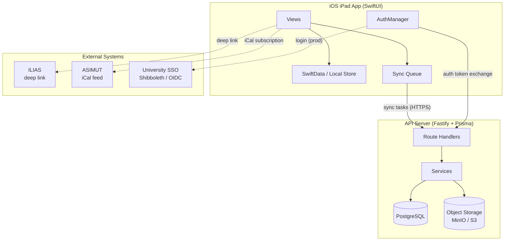
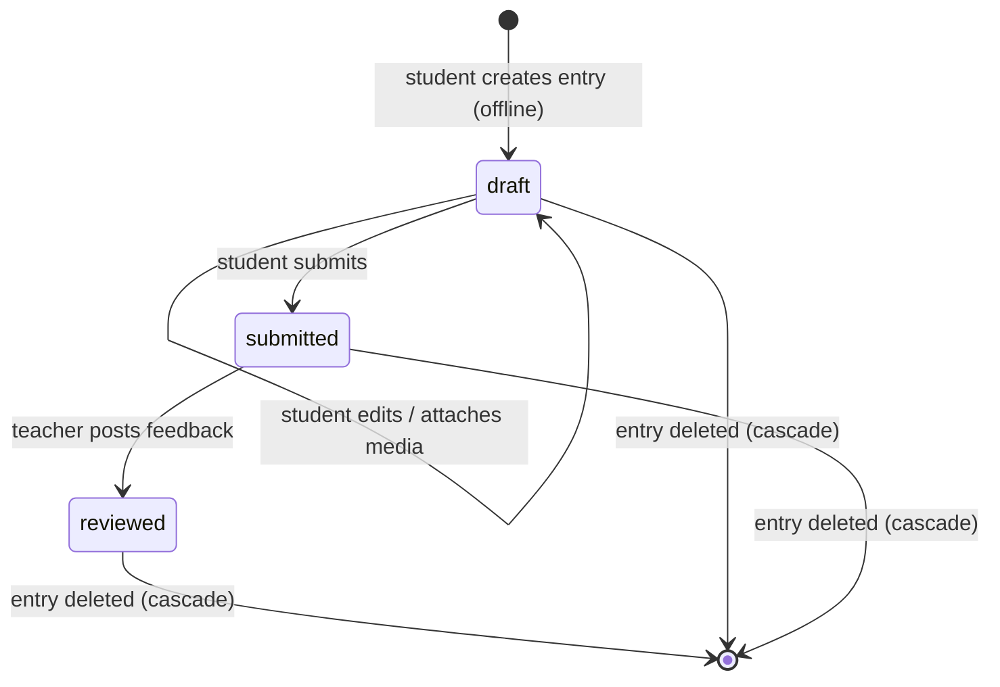

# Architecture

## System Overview



## Entry Lifecycle



## Components

- iOS iPad app (SwiftUI): offline-first UI, SwiftData store, background sync queue.
- API server (Fastify + Prisma): auth, course context, entries, feedback, media pre-signed URLs.
- Postgres: metadata and access control.
- Object storage (S3-compatible, MinIO in dev): media artifacts.
- ILIAS: course context via deep link (MVP), optional LTI launch documented.
- ASIMUT: iCal feed consumed directly by app.

## Client Structure

The iOS app starts in `ResonanceApp.swift`, opens the shared SwiftData `ModelContainer`, and injects one `AppState` into the SwiftUI tree. `AppState` wires together the long-lived services used by views:

- `AuthManager`: ASWebAuthenticationSession login, keychain-backed token persistence, refresh-token rotation, and logout.
- `APIClient`: typed HTTP wrapper for the Fastify API and the S3-compatible presign/confirm flow.
- `SyncManager`: background-safe queue coordinator; delegates persistence to `QueueStore`, retry decisions to `RetryPolicy`, and concrete network work to `TaskExecutor`.
- `NetworkMonitor`: reachability gate so offline queue items wait instead of failing immediately.

## Server Structure

```
server/src/
  routes/          # Fastify route handlers (auth, courses, entries, artifacts, feedback)
  services/        # Business logic extracted from routes
    entryCascade.ts  # Artifact + storage cleanup on entry delete
  auth.ts          # JWT sign/verify, token issuance, refresh rotation
  config.ts        # Env-var parsing and startup validation
  errors.ts        # ApiError class, withPrismaErrors wrapper
  errorCodes.ts    # Centralized error code constants
  validation.ts    # Input validation helpers (requireString, requireEntryAccess, …)
  server.ts        # Fastify factory; registers all plugins and route handlers
```

## iOS Sync Architecture

The sync subsystem is split into four focused components:

- **`SyncManager`** — thin coordinator: auth-refresh gating, network check, queue state machine (fetching ready items, applying retry decisions, updating status). Does not contain business logic.
- **`QueueStore`** — all SwiftData I/O: enqueue, fetchReady, fetchFailed, counts, status mutations, artifact state helpers.
- **`TaskExecutor`** — executes a single queue item against the API: one `switch` over `SyncTaskType`, handles idempotency (409 = success for creates, 404 = success for deletes).
- **`RetryPolicy`** — stateless: exponential backoff calculation, terminal-error classification (validation errors, local-not-found, permission errors are immediately terminal; transient network errors are retried).
- **`EntryDeletionCoordinator`** — coordinates offline-safe entry deletion: cancels in-flight queue items for the entry's artifacts, deletes local files, enqueues a remote delete only when the entry was already synced to the server.
- **`CalendarSubscriptionStore`** — persists the iCal subscription URL in Keychain (migrates legacy UserDefaults value on first access).

## Optional LTI (Minimal)

- If ILIAS supports LTI launch, an LTI 1.3 launch can redirect to the same universal link with `courseId`.
- The MVP does not implement a full LTI platform; it only documents the mapping and relies on deep links.

## Data Flow

1. User signs in via ASWebAuthenticationSession → app opens `GET /auth/login` → server routes to dev login locally or university OIDC in production → `/auth/oidc/callback` validates, upserts user, issues internal code → app receives `resonance://auth-callback?code=...`.
2. App exchanges internal code via `POST /auth/session` → receives JWT access token + refresh token.
3. App syncs course/membership list into SwiftData.
4. Student creates entry offline → stored locally → queued for sync.
5. Sync worker sends media metadata to server → requests pre-signed PUT URL → uploads media → confirms upload.
6. Practice audio uploads through the normal queue. Teaching-lesson video remains local until the student confirms the private course-review consent scope and starts submission; capture profiles and manual markers provide context for later review without automatic analysis.
7. Student submits entry (`draft → submitted`); teacher fetches review queue.
8. Teacher posts feedback → parent entry transitions to `reviewed` → student sees feedback on next sync.

## Offline Strategy

- Local-first writes to SwiftData with a persistent sync queue.
- Background sync using `URLSession` with `.default` configuration and exponential backoff. (URLSession background configuration is intentionally not used because it does not support the Swift concurrency `upload(for:from:)` API required for async artifact uploads.)
- Last-write-wins for entry edits; feedback is append-only server-side.

## Pagination

Both the review queue (`GET /courses/:courseId/review-queue`) and the entries list (`GET /courses/:courseId/entries`) use cursor-based pagination. The response shape is `{ items: [...], nextCursor: string | null }`. Clients pass `?cursor=<entryId>&limit=N` to fetch subsequent pages. The sort order is deterministic: `practiceDate DESC`, `createdAt DESC`, `id DESC` (three-column tiebreaker). Default page size is 50, maximum is 200.

## Error Handling

API returns consistent error objects:
```
{
  "error": {
    "code": "STRING_CODE",
    "message": "Human readable message",
    "details": { "optional": true }
  }
}
```

All error codes are centralized in `errorCodes.ts`. Routes use `withPrismaErrors()` (from `errors.ts`) to translate Prisma-specific exceptions (P2002 unique conflict, P2025 not-found) into structured API errors, avoiding raw 500 responses from database constraint violations.

## Test Coverage

The server test suite covers:

- Authentication and authorization (dev auth, ACL, course-role vs global-role)
- Input validation (client IDs, strings, dates, enums)
- Entry lifecycle (create, update, submit, delete, status transitions, single-entry fetch)
- Artifact upload flow (presign, confirm, ownership)
- Feedback (creation, permissions, deleted-entry guards)
- Review queue pagination and entries list pagination (cursor-based, deterministic ordering)
- Security headers, CORS, rate limiting, and content-type enforcement
- Error handling (structured errors, Prisma error mapping, stack trace suppression)
