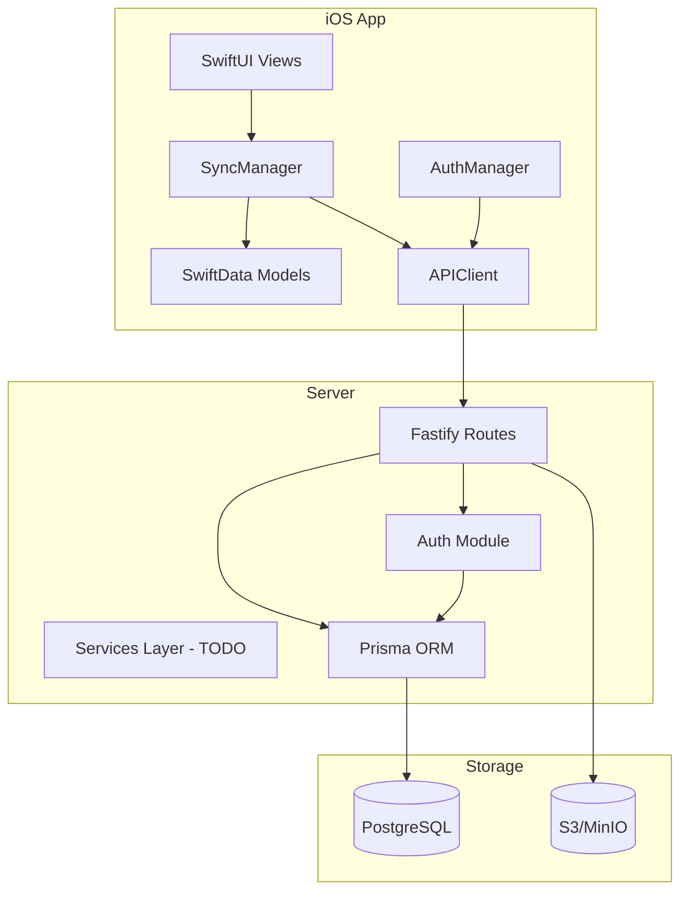

# Resonance Project Improvement Plan

## Overview

This comprehensive plan covers repo cleanup, documentation consolidation, code improvements, deduplication, refactoring, QoL improvements, new features, and UI enhancements for the Resonance project - an iPad-first, offline-first practice evidence and feedback app for a music university.

---

## 1. Repo Cleanup

### 1.1 Root Directory Cleanup
- [ ] Review and consolidate `.gitignore` entries (currently 941 chars - may have redundancies)
- [ ] Evaluate if `CHANGELOG.md`, `CONTRIBUTING.md`, `SECURITY.md` are needed at root or can be moved to docs

### 1.2 GitHub Workflows
- [ ] Review `.github/` directory for CI/CD workflows
- [ ] Ensure all workflows are active and necessary

### 1.3 Scripts Directory
- [ ] Verify `scripts/ci-local.sh` and `scripts/secret-scan.sh` are still relevant
- [ ] Consider consolidating into npm scripts or Makefile

---

## 2. Documentation Cleanup & Consolidation

### 2.1 Current Documentation Structure
```
docs/
├── API.md           # 2382 chars - API reference
├── ARCHITECTURE.md  # 1542 chars - Architecture overview
├── ASSUMPTIONS.md   # 1442 chars - Product assumptions
├── BUGS_AND_FIXES.md # 23806 chars - Known bugs (47 items)
├── DATA_MODEL.md    # 1079 chars - Data model
├── PRD.md           # 2110 chars - Product requirements
├── RUNBOOK.md       # 2161 chars - Ops runbook
├── SECURITY.md      # 1824 chars - Security documentation
├── UI.md            # 895 chars - UI spec
└── USER_STORIES.md  # 2903 chars - User stories
```

### 2.2 Recommended Actions

#### Consolidate into Fewer Documents
- [ ] **Merge into PRD.md**: Move USER_STORIES.md and ASSUMPTIONS.md content into PRD.md
- [ ] **Merge into ARCHITECTURE.md**: Move DATA_MODEL.md content into ARCHITECTURE.md
- [ ] **Create CHANGELOG from BUGS_AND_FIXES.md**: Convert BUGS_AND_FIXES.md into GitHub Issues, keep only quick-reference table
- [ ] **Consolidate Security Docs**: Merge docs/SECURITY.md with root SECURITY.md

#### Proposed New Structure
```
docs/
├── PRD.md              # Product requirements + user stories + assumptions
├── ARCHITECTURE.md     # Architecture + data model
├── API.md              # API reference (keep as-is)
├── UI.md               # UI spec (keep as-is)
├── RUNBOOK.md          # Ops runbook (keep as-is)
└── SECURITY.md         # Consolidated security documentation
```

#### Files to Remove After Consolidation
- [ ] `docs/USER_STORIES.md` - merge into PRD.md
- [ ] `docs/ASSUMPTIONS.md` - merge into PRD.md
- [ ] `docs/DATA_MODEL.md` - merge into ARCHITECTURE.md
- [ ] `docs/BUGS_AND_FIXES.md` - convert to GitHub Issues, keep quick-reference only
- [ ] Root `SECURITY.md` - consolidate into docs/SECURITY.md

---

## 3. Code Improvements - Critical Bugs

Based on BUGS_AND_FIXES.md analysis, prioritize these critical issues:

### 3.1 Security Fixes (Critical)

#### IDOR Vulnerabilities
- [ ] **Fix requireEntryAccess global role issue** - Use course role instead of global role for authorization
  - File: [`server/src/validation.ts`](server/src/validation.ts)
  - Issue: Users with global teacher role but course student role can access any entry
  
- [ ] **Fix artifact confirm ownership check** - Add student ownership validation
  - File: [`server/src/routes/artifacts.ts`](server/src/routes/artifacts.ts:77-113)
  - Issue: Any course member can confirm any artifact

- [ ] **Fix presign authorization** - Restrict presign to owning student only
  - File: [`server/src/routes/artifacts.ts`](server/src/routes/artifacts.ts:47-75)
  - Issue: Global teacher can get PUT URLs for others artifacts

- [ ] **Fix feedback route authorization** - Use course role for feedback operations
  - File: [`server/src/routes/feedback.ts`](server/src/routes/feedback.ts)
  - Issue: Global role used instead of course role

#### Authentication Issues
- [ ] **Fix refresh token rotation atomicity** - Wrap in proper transaction
  - File: [`server/src/auth.ts`](server/src/auth.ts:67-105)
  - Issue: Non-atomic rotation allows token duplication

- [ ] **Add JWT iss/aud/algorithms constraints**
  - File: [`server/src/auth.ts`](server/src/auth.ts:14-46)
  - Issue: Minimal JWT options, no issuer/audience/algorithm allowlist

- [ ] **Validate token TTL environment variables**
  - File: [`server/src/config.ts`](server/src/config.ts)
  - Issue: NaN and negative values accepted

### 3.2 Data Integrity Fixes

- [ ] **Fix entry delete order** - DB transaction before S3 delete
  - File: [`server/src/routes/entries.ts`](server/src/routes/entries.ts:86-140)
  - Issue: S3 delete before DB transaction causes inconsistent state

- [ ] **Add redirectUri validation for auth**
  - File: [`server/src/routes/auth.ts`](server/src/routes/auth.ts)
  - Issue: redirectUri accepted but never validated

- [ ] **Fix submitted-entry edit lock bypass**
  - File: [`server/src/routes/entries.ts`](server/src/routes/entries.ts:55-84)
  - Issue: Falsy values like empty string bypass the lock

### 3.3 iOS Critical Fixes

- [ ] **Fix ATS disabled issue**
  - File: [`ios/ResonanceApp/Sources/Resources/Info.plist`](ios/ResonanceApp/Sources/Resources/Info.plist)
  - Issue: NSAllowsArbitraryLoads = true, disable ATS for localhost only

- [ ] **Fix date decoding fractional seconds**
  - File: [`ios/ResonanceApp/Sources/APIClient.swift`](ios/ResonanceApp/Sources/APIClient.swift:165-171)
  - Issue: ISO8601 decoder rejects fractional seconds

- [ ] **Fix Optional.none JSON serialization**
  - File: [`ios/ResonanceApp/Sources/APIClient.swift`](ios/ResonanceApp/Sources/APIClient.swift:35-53)
  - Issue: nil optionals break JSONSerialization

- [ ] **Fix sync queue silent data loss**
  - File: [`ios/ResonanceApp/Sources/SyncManager.swift`](ios/ResonanceApp/Sources/SyncManager.swift:83-144)
  - Issue: Parse failures and unknown types cause silent item deletion

---

## 4. Code Deduplication

### 4.1 Server-Side Deduplication

#### Route Handler Patterns
- [ ] **Extract common authorization middleware**
  - Files: All route files in `server/src/routes/`
  - Pattern: `requireCourseRole` + ownership checks repeated
  - Solution: Create reusable authorization helpers

- [ ] **Extract common error handling patterns**
  - Files: All route files
  - Pattern: Similar try-catch and error response patterns
  - Solution: Create error handling wrapper or decorator

#### Validation Code
- [ ] **Consolidate validation helpers**
  - File: [`server/src/validation.ts`](server/src/validation.ts)
  - Current: Multiple similar require* functions
  - Solution: Create generic validation builder pattern

### 4.2 iOS-Side Deduplication

#### API Client Methods
- [ ] **Extract common request/response handling**
  - File: [`ios/ResonanceApp/Sources/APIClient.swift`](ios/ResonanceApp/Sources/APIClient.swift)
  - Pattern: Similar send() calls with minor variations
  - Solution: Create typed request builders

#### Model Patterns
- [ ] **Extract common model patterns**
  - File: [`ios/ResonanceApp/Sources/Models.swift`](ios/ResonanceApp/Sources/Models.swift)
  - Pattern: Raw value encoding/decoding for enums
  - Solution: Create protocol extensions for enum raw value handling

#### View Components
- [ ] **Extract common UI components**
  - Files: All views in `ios/ResonanceApp/Sources/Views/`
  - Pattern: Similar loading states, error handling
  - Solution: Create reusable view modifiers/components

---

## 5. Code Refactoring

### 5.1 Server Architecture Refactoring

#### Route Organization
- [ ] **Create route-specific types and interfaces**
  - Current: Inline type casting in route handlers
  - Solution: Define typed request/response interfaces

- [ ] **Extract business logic from routes**
  - Current: Business logic mixed with HTTP handling
  - Solution: Create service layer (EntryService, ArtifactService, etc.)

#### Configuration Management
- [ ] **Improve config validation and typing**
  - File: [`server/src/config.ts`](server/src/config.ts)
  - Current: Loose typing, runtime errors possible
  - Solution: Zod or similar schema validation

### 5.2 iOS Architecture Refactoring

#### State Management
- [ ] **Improve AppState and AuthManager separation**
  - Files: [`ios/ResonanceApp/Sources/AppState.swift`](ios/ResonanceApp/Sources/AppState.swift), [`ios/ResonanceApp/Sources/AuthManager.swift`](ios/ResonanceApp/Sources/AuthManager.swift)
  - Current: Overlapping responsibilities
  - Solution: Clear separation of concerns

#### Error Handling
- [ ] **Create unified error handling system**
  - Current: Errors handled differently across components
  - Solution: Centralized error type and handler

#### Sync Manager
- [ ] **Improve SyncManager architecture**
  - File: [`ios/ResonanceApp/Sources/SyncManager.swift`](ios/ResonanceApp/Sources/SyncManager.swift)
  - Current: Monolithic, hard to test
  - Solution: Split into SyncQueue, SyncProcessor, SyncRetryStrategy

---

## 6. Quality of Life Improvements

### 6.1 Developer Experience

- [ ] **Add request/response logging in development**
  - Server: Structured logging with request IDs
  - iOS: Network activity logging

- [ ] **Improve error messages**
  - Server: More descriptive error codes and messages
  - iOS: User-friendly error display

- [ ] **Add development tooling**
  - Server: Hot reload improvements
  - iOS: Debug menu for environment switching

### 6.2 Testing Improvements

- [ ] **Add missing test coverage**
  - Files: [`server/tests/`](server/tests/)
  - Missing: submit, feedback GET, auth/me, course detail, dev/authorize

- [ ] **Add ACL tests for role mismatch scenarios**
  - File: [`server/tests/acl.test.ts`](server/tests/acl.test.ts)
  - Missing: Global-role vs course-role, artifact IDOR

- [ ] **Force test database requirement**
  - Files: [`server/tests/vitest.setup.ts`](server/tests/vitest.setup.ts), [`server/tests/testUtils.ts`](server/tests/testUtils.ts)
  - Issue: Tests can TRUNCATE non-test database

### 6.3 Documentation Improvements

- [ ] **Add inline code documentation**
  - Server: JSDoc comments for public functions
  - iOS: Swift DocC documentation

- [ ] **Add architecture decision records (ADRs)**
  - Document key decisions for future reference

---

## 7. New Features

### 7.1 Authentication & Security

- [ ] **Implement server-side logout**
  - Add `/auth/logout` endpoint
  - Revoke refresh tokens on sign-out

- [ ] **Add session management**
  - View active sessions
  - Revoke specific sessions

### 7.2 User Experience

- [ ] **Add offline indicator**
  - Clear visual feedback when offline
  - Queue status display

- [ ] **Improve sync feedback**
  - Progress indicators for uploads
  - Retry buttons for failed items

- [ ] **Add pull-to-refresh**
  - Refresh course list and entries

### 7.3 Teacher Features

- [ ] **Bulk feedback actions**
  - Approve multiple entries
  - Template feedback responses

- [ ] **Feedback history**
  - View past feedback for a student

### 7.4 Student Features

- [ ] **Practice statistics**
  - Total practice time
  - Goals completed

- [ ] **Entry templates**
  - Reusable goal/tag combinations

---

## 8. UI Improvements

### 8.1 Visual Design

- [ ] **Consistent styling**
  - Define color palette and typography
  - Apply consistent spacing

- [ ] **Improve empty states**
  - Better illustrations and guidance
  - Action buttons for empty states

### 8.2 Accessibility

- [ ] **Add accessibility labels**
  - VoiceOver support
  - Dynamic Type support

- [ ] **Improve contrast and readability**
  - WCAG compliance check

### 8.3 User Flows

- [ ] **Simplify entry creation**
  - Reduce taps to create entry
  - Quick actions from course list

- [ ] **Improve feedback viewing**
  - Better marker visualization
  - Audio playback with markers

---

## 9. Implementation Priority

### Phase 1: Critical Security Fixes (Immediate)
1. Fix IDOR vulnerabilities (requireEntryAccess, artifact confirm, presign)
2. Fix refresh token rotation atomicity
3. Fix ATS disabled issue
4. Add JWT constraints

### Phase 2: Data Integrity (High Priority)
1. Fix entry delete order
2. Fix sync queue data loss
3. Add redirectUri validation
4. Fix submitted-entry lock bypass

### Phase 3: Code Quality (Medium Priority)
1. Documentation consolidation
2. Code deduplication
3. Test coverage improvements
4. Error handling improvements

### Phase 4: Features & UI (Lower Priority)
1. New features implementation
2. UI improvements
3. Accessibility improvements

---

## 10. Architecture Diagram



---

## 11. File Change Summary

### Files to Modify
| File | Changes |
|------|---------|
| `server/src/auth.ts` | JWT constraints, token rotation fix |
| `server/src/validation.ts` | Course role authorization fixes |
| `server/src/routes/entries.ts` | Delete order, edit lock fix |
| `server/src/routes/artifacts.ts` | Ownership checks |
| `server/src/routes/feedback.ts` | Course role authorization |
| `server/src/config.ts` | Config validation |
| `ios/ResonanceApp/Sources/APIClient.swift` | Date decoding, JSON encoding |
| `ios/ResonanceApp/Sources/SyncManager.swift` | Error handling, data loss fix |
| `ios/ResonanceApp/Sources/Resources/Info.plist` | ATS configuration |

### Files to Create
| File | Purpose |
|------|---------|
| `server/src/services/entryService.ts` | Entry business logic |
| `server/src/services/artifactService.ts` | Artifact business logic |
| `server/src/middleware/authorization.ts` | Reusable authorization |
| `ios/ResonanceApp/Sources/Services/` | Service layer |
| `ios/ResonanceApp/Sources/Extensions/` | Swift extensions |

### Files to Remove
| File | Reason |
|------|--------|
| `docs/USER_STORIES.md` | Merge into PRD.md |
| `docs/ASSUMPTIONS.md` | Merge into PRD.md |
| `docs/DATA_MODEL.md` | Merge into ARCHITECTURE.md |
| `docs/BUGS_AND_FIXES.md` | Convert to GitHub Issues |
| `SECURITY.md` (root) | Consolidate into docs/ |

---

## 12. Next Steps

1. **Review this plan** and prioritize based on current needs
2. **Create GitHub Issues** for each actionable item
3. **Switch to Code mode** for implementation
4. **Implement in phases** as outlined above
